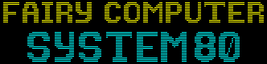

FAIRY COMPUTER SYSTEM 80(FCS80)は、8 ビット時代の技術である Z80 と AY-3-8910、そして Z80 での使いやすさを追求した新しい VDP (FCS80-VIDEO) を搭載した新しいレトロゲーム機です。
このリポジトリでは、FCS80 コアシステムの公式エミュレータを提供しています。

## Table of content

- [1. Specification](#1-specification) (仕様)
- [2. Memory Map](#2-memory-map) (メモリマップ)
  - [2-1. CPU Memory](#2-1-cpu-memory) (CPU メモリ)
  - [2-2. VRAM](#2-2-vram) (ビデオメモリ)
  - [2-3. SCC](#2-3-scc) (SCC)
  - [2-4. RAM](#2-4-ram)
- [3. I/O map](#3-io-map) (I/O マップ)
  - [3-1. $A0~$A2 or $D0~$DF: AY-3-8910](#3-1-a0a2-or-d0df-ay-3-8910) (AY-3-8910: PSG 音源)
  - [3-2. $B0~$B3: Bank switch](#3-2-b0b3-bank-switch) (バンク切り替え)
  - [3-3. $C0: High Speed DMA (Bank to VRAM)](#3-3-c0-high-speed-dma-bank-to-vram) (高速 DMA)
  - [3-4. $C1: CPU boost flag](#3-4-c1-cpu-boost-flag) (CPU 高速化フラグ)
  - [3-5. $C2: memset](#3-5-c2-memset)
  - [3-6. $C3: memcpy](#3-6-c3-memcpy)
- [4. ROM](#4-rom)
  - [4-1. File Format](#4-1-file-format) (ファイル構造)
- [5. Programming Guide](#5-programming-guide) (プログラミングガイド)
  - [5-1. Make your development environment](#5-1-make-your-development-environment) (開発環境の準備)
  - [5-2. Example](#5-2-example) (実装例)
  - [5-3. Notes for keeping the compatible](#5-3-notes-for-keeping-the-compatible) (互換性維持のための注意点)
  - [5-4. Toolchain](#5-4-toolchain) (ツールチェイン)
- [6. HAL Implementation Guide](#6-hal-implementation-guide) (HAL 実装ガイド)
  - [6-1. Integrate it into your project](#6-1-integrate-it-into-your-project) (FCS80 コアモジュールをプロジェクトへ統合)
  - [6-2. How to use the FCS80 emulator](#6-2-how-to-use-the-fcs80-emulator) (FCS80 エミュレータの使い方)
  - [6-3. Example](#6-3-example) (実装例)

## 1. Specification

- CPU: Z80A (3579545Hz)
- VDP: FCS80-VDP (4024320Hz)
  - 画面解像度: 240x192
  - バックグラウンド・フォアグラウンドの 2 レイヤー構造の 8x8 タイル形式のグラフィック表示 (仮想スクリーンサイズ: 256x256)
  - 最大スプライト数: 256 (サイズは 8x8) & 水平リミット: 256 (無制限)
  - スキャンライン数: 262 (NTSC)
  - フレームレート: 秒間 60 フレーム (60fps)
  - 表示色数: 65536 色中 256 色
- APU: AY-3-8910 (44100Hz)
- RAM: 16KB
- VRAM: 16KB

## 2. Memory Map

### 2-1. CPU Memory

FCS80 は、Z80 のメモリ空間（64KB）の上位 32KB を プログラム、下位 32KB を メモリマップ に割り当てています。

- プログラム（上位 32KB）は 8KB 毎の 4 バンク (PRG0, PRG1, PRG2 and PRG3) に分割されています
  - プログラム領域は読み出し専用
  - [3-2. $B0~$B3: Bank switch](#3-2-b0b3-bank-switch) でバンク切り替えが可能
- メモリマップ（下位 32KB）は、その上位 16KB を VRAM、下位 16KB を RAM に割り当てています
  - メモリマップは読み書き可能
  - 拡張 RAM (RAM をバンク切り替えする仕組み) は提供していない

|    Address    | Map                                 |
| :-----------: | :---------------------------------- |
| $0000 ~ $1FFF | PRG0: ROM Bank #0 (Program)         |
| $2000 ~ $3FFF | PRG1: ROM Bank #1 (Program or Data) |
| $4000 ~ $5FFF | PRG2: ROM Bank #2 (Program or Data) |
| $6000 ~ $7FFF | PRG3: ROM Bank #3 (Program or Data) |
| $8000 ~ $97FF | VRAM (Name Table, OAM, Registers)   |
| $9800 ~ $98FF | SCC                                 |
| $A000 ~ $BFFF | VRAM (Character Pattern)            |
| $C000 ~ $FFFF | RAM (16KB)                          |

#### コラム: SRAM がないことについて

FCS80 は Static-RAM（バッテリーバックアップ）を搭載していません。
これは、セーブとロードは、ステートセーブとステートロードによって要件を満たせるという考えに基づいています。
ハイスコアをローカルに保持したい場合もあるでしょうが、リーダーボードについては、FCS80 の外部から（RAM を読み込むなどして）取得し、 ゲームの外部に実装するのが望ましいと考えています。

#### コラム: RAM サイズが 16KB であることについて

現代のプログラム環境では、RAM が 16KB しか無いとまともにプログラム開発できませんが、8bit 時代の打標的なゲームコンソールの場合 RAM は 2KB 前後が標準でした。
そのため、16KB もあればゲーム開発には十分すぎるメモリサイズです。
フルアセンブリ言語ならもちろん、C 言語での開発ですら可能な水準のメモリサイズです。

### 2-2. VRAM

|  CPU address  | VRAM address  | Map                                                |
| :-----------: | :-----------: | :------------------------------------------------- |
| $8000 ~ $83FF | $0000 ~ $03FF | BG Name Table (32 x 32)                            |
| $8400 ~ $87FF | $0400 ~ $07FF | BG Attribute Table (32 x 32)                       |
| $8800 ~ $8BFF | $0800 ~ $0BFF | FG Name Table (32 x 32)                            |
| $8C00 ~ $8FFF | $0C00 ~ $0FFF | FG Attribute Table (32 x 32)                       |
| $9000 ~ $93FF | $1000 ~ $13FF | OAM; Object Attribute Memory (4 x 256)             |
| $9400 ~ $95FF | $1400 ~ $15FF | Palette Table (2 x 16 x 16)                        |
|     $9600     |     $1600     | Register #0: 垂直スキャンライン位置 (読み取り専用) |
|     $9601     |     $1601     | Register #1: 水平スキャンライン位置 (読み取り専用) |
|     $9602     |     $1602     | Register #2: BG スクロール位置 X                   |
|     $9603     |     $1603     | Register #3: BG スクロール位置 Y                   |
|     $9604     |     $1604     | Register #4: FG スクロール位置 X                   |
|     $9605     |     $1605     | Register #5: FG スクロール位置 Y                   |
|     $9606     |     $1606     | Register #6: IRQ スキャンライン位置 (0: 無効)      |
|     $9607     |     $1607     | Register #7: Status (読み取り専用)                 |
| $A000 ~ $BFFF | $2000 ~ $3FFF | Character Pattern Table (32 x 256)                 |

#### VRAM アクセス

代表的な 8bit コンソールの VDP（ファミリーコンピュータの PPU や MSX の VDP など）の場合、アドレス設定ポートに 2 回値を書き込むことで VRAM のアクセスアドレスを設定して、書き込みポートや読み込みポートを介してアクセスするのが一般的です。

FCS80-VIDEO では、VRAM の全アドレスが CPU メモリにマップされているので、RAM にアクセスする時と同様、LD や LDIR といった命令で VRAM の書き込みや読み込みを行うことができます。

#### グラフィックのレイヤー構造

| 描画優先順位 | 名称                    | 概要                                                                                                                                                                   |
| :----------: | :---------------------- | :--------------------------------------------------------------------------------------------------------------------------------------------------------------------- |
|      1       | FG; Foreground Graphics | 最優先で描画されるグラフィックスです。ゲーム画面のフレームを描画したり、スコアを表示したりする用途を想定しています。                                                   |
|      2       | Sprites                 | これらのグラフィックスは、画面上で動き回るキャラクターの描画に使用することを想定しています。BG や FG とは異なり、描画データは Name Table ではなく OAM で管理されます。 |
|      3       | BG; Background Graphics | 描画の優先順位が最も低いグラフィックスで、ゲーム画面の背景を描くためのものです。                                                                                       |

#### Name Table & Scroll (BG/FG)

- 32 x 32 キャラクタ = 256 x 256 ピクセル
- 画面左右と上の端 8px はマスクされます（スクロール値が 0 の場合）
- 画面下端 56px はマスクされます（スクロール値が 0 の場合）
- レジスタ #2 ~ #5 に画面左上の座標（基点座標）を指定することでスクロールすることができます

#### Attribute bit-layout (BG/FG/Sprite)

| Bit-7 | Bit-6 | Bit-5 | Bit-4 | Bit-3 | Bit-2 | Bit-1 | Bit-0 |
| :---: | :---: | :---: | :---: | :---: | :---: | :---: | :---: |
|  VI   |  UD   |  LR   |   -   |  P3   |  P2   |  P1   |  P0   |

- VI: 0 = 非表示, 1 = 表示 (※BG の場合は常に表示)
- UD: 1 = 上下反転
- LR: 1 = 左右反転
- P0 ~ P3: パレット番号 (0 ~ 15)

#### Object Attribute Memory (Sprite)

```c
struct OAM {
    unsigned char y;
    unsigned char x;
    unsigned char pattern;
    unsigned char attribute;
} oam[256];
```

#### Palette Table

- FCS80 は 16 個のパレットを持つことができます
- 1 つのパレットは 16 の色情報を持っています
- 色情報 = RGB555 (16bit / little endian) 形式

ビットレイアウト:

(下位 8bit)

| Bit-7 | Bit-6 | Bit-5 | Bit-4 | Bit-3 | Bit-2 | Bit-1 | Bit-0 |
| :---: | :---: | :---: | :---: | :---: | :---: | :---: | :---: |
|   -   |  r4   |  r3   |  r2   |  r1   |  r0   |  g4   |  g3   |

(上位 8bit)

| Bit-7 | Bit-6 | Bit-5 | Bit-4 | Bit-3 | Bit-2 | Bit-1 | Bit-0 |
| :---: | :---: | :---: | :---: | :---: | :---: | :---: | :---: |
|  g2   |  g1   |  g0   |  b4   |  b3   |  b2   |  b1   |  b0   |

- r4 ~ r0 : 赤 (0 ~ 31)
- g4 ~ g0 : 緑 (0 ~ 31)
- b4 ~ b0 : 青 (0 ~ 31)

#### Register #0: Scanline vertical counter (read only)

- $00 ~ $07 : 上部ブランクを描画中 (0 ~ 7)
- $08 ~ $C7 : アクティブ (8 ~ 199)
- $FF : 下部ブランクを描画中 (200 ~ 261)

#### Register #1: Scanline horizontal counter (read only)

- $00 ~ $07 : 左ブランクを描画中
- $08 ~ $F7 : アクティブ (描画ピクセル位置: 8 ~ 247)
- $F8 ~ $FF : 右ブランクを描画中

#### Register #7: Status (read only)

| Bit-7 | Bit-6 | Bit-5 | Bit-4 | Bit-3 | Bit-2 | Bit-1 | Bit-0 |
| :---: | :---: | :---: | :---: | :---: | :---: | :---: | :---: |
|  BL   |   -   |   -   |   -   |   -   |   -   |   -   |   -   |

- BL: 1 = 垂直方向の下部ブランク開始

注意: Status レジスタは、読み取ると 0 にリセットされます

(垂直ブランクの待機実装例)

```z80
.wait_vblank
    ld hl, $9607
wait_vblank_loop:
    ld a, (hl)
    and $80
    jp nz, wait_vblank_loop
    ret
```

#### Character Pattern Table

- Character Pattern Table には 256 個の of 8x8 キャラクタデータが格納されています
- 1 キャラクタ: 32 バイト
- テーブルサイズ: 32 x 256 = 8192 バイト

キャラクタ毎のビットレイアウト:

| px0 | px1 | px2 | px3 | px4 | px5 | px6 | px7 | Line number |
| :-: | :-: | :-: | :-: | :-: | :-: | :-: | :-: | :---------- |
| H00 | L00 | H01 | L01 | H02 | L02 | H03 | L03 | Line 0      |
| H04 | L04 | H05 | L05 | H06 | L06 | H07 | L07 | Line 1      |
| H08 | L08 | H09 | L09 | H10 | L10 | H11 | L11 | Line 2      |
| H12 | L12 | H13 | L13 | H14 | L14 | H15 | L15 | Line 3      |
| H16 | L16 | H17 | L17 | H18 | L18 | H19 | L19 | Line 4      |
| H20 | L20 | H21 | L21 | H22 | L22 | H23 | L23 | Line 5      |
| H24 | L24 | H25 | L25 | H26 | L26 | H27 | L27 | Line 6      |
| H28 | L28 | H29 | L29 | H30 | L30 | H31 | L31 | Line 7      |

- `Hxx` : xx バイト目の上位 4bit (ピクセルの色コード)
- `Lxx` : xx バイト目の上位 4bit (ピクセルの色コード)
- 色コード 0 は FG またはスプライトの場合は透明になります

### 2-3. SCC

FCS80 では KONAMI の SCC (SOUND CREATIVE CHIP) と互換性のある波形メモリ音源を使うことができます。

仕様:

- チャネル数: 5
- 波形メモリ:
  - 4 waveforms x 32 bytes signed
  - 4 waveforms: Ch1 ~ Ch3 は独立した波形テーブルを定義, Ch4 と Ch5 は共通の波形テーブルを定義
- 音程: PSG と同様 ([Register 0~5: Tone generator - 音程](#register-05-tone-generator---音程)を参照)
- 音量: 0 ~ 15 (4bits) ※各チャネル毎独立

| Address | r | w | Desciption |
|:-----------:|:-:|:-:|:-|
| $9800~$981F | o | o | 32 bytes signed to define the envelope (waveform) of the channel 1 |
| $9820~$983F | o | o | 32 bytes signed to define the envelope (waveform) of the channel 2 |
| $9840~$985F | o | o | 32 bytes signed to define the envelope (waveform) of the channel 3 |
| $9860~$987F | o | o | 32 bytes signed to define the envelope (waveform) of the channel 4 and 5 |
| $9880~$9881 | - | o | Channel 1 frequency on 12bit |
| $9882~$9883 | - | o | Channel 2 frequency on 12bit |
| $9884~$9885 | - | o | Channel 3 frequency on 12bit |
| $9886~$9887 | - | o | Channel 4 frequency on 12bit |
| $9888~$9889 | - | o | Channel 5 frequency on 12bit |
|    $988A    | - | o | Channel 1 volume (bits 4~7 are ignored) |
|    $988B    | - | o | Channel 2 volume (bits 4~7 are ignored) |
|    $988C    | - | o | Channel 3 volume (bits 4~7 are ignored) |
|    $988D    | - | o | Channel 4 volume (bits 4~7 are ignored) |
|    $988E    | - | o | Channel 5 volume (bits 4~7 are ignored) |
|    $988F    | - | o | ON/OFF switch for each channel from 1 to 5 (bits 0~4 = Channels 1~5) |
| $9890~$98FF | - | - | Reserved |

> 上記のアドレスマップは KONAMI の 大半の SCC 対応 MSX ゲームソフト（※スナッチャーを除く）と互換性があります。

### 2-4. RAM

|  CPU address  |  RAM address  | Map                  |
| :-----------: | :-----------: | :------------------- |
| $C000 ~ $FFFF | $0000 ~ $3FFF | Random Access Memory |

## 3. I/O map

|   Port    |  I  |  O  | Description                                         |
| :-------: | :-: | :-: | :-------------------------------------------------- |
|    $A0    |  o  |  -  | AY-3-8910: レジスタ番号                             |
|    $A1    |  -  |  o  | AY-3-8910: レジスタに値を書き込む                   |
|    $A2    |  -  |  o  | AY-3-8910: レジスタから値を読み込む                 |
|    $B0    |  o  |  o  | PRG0 バンク切り替え (リセット時のデフォルト値: $00) |
|    $B1    |  o  |  o  | PRG1 バンク切り替え (リセット時のデフォルト値: $01) |
|    $B2    |  o  |  o  | PRG2 バンク切り替え (リセット時のデフォルト値: $02) |
|    $B3    |  o  |  o  | PRG3 バンク切り替え (リセット時のデフォルト値: $03) |
|    $C0    |  -  |  o  | 高速 DMA (ROM to VRAM: Character Pattern Table)     |
| $D0 ~ $DF |  o  |  o  | AY-3-8910 レジスタのダイレクト読み込み・書き込み    |

### 3-1. $A0~$A2 or $D0~$DF: AY-3-8910

| Register |  I  |  O  | Feature                        |
| :------: | :-: | :-: | :----------------------------- |
|    0     |  o  |  o  | Ch0 tone generator (low 8bit)  |
|    1     |  o  |  o  | Ch0 tone generator (high 4bit) |
|    2     |  o  |  o  | Ch1 tone generator (low 8bit)  |
|    3     |  o  |  o  | Ch1 tone generator (high 4bit) |
|    4     |  o  |  o  | Ch2 tone generator (low 8bit)  |
|    5     |  o  |  o  | Ch2 tone generator (high 4bit) |
|    6     |  o  |  o  | Noise generator                |
|    7     |  o  |  o  | Mixing                         |
|    8     |  o  |  o  | Ch0 volume                     |
|    9     |  o  |  o  | Ch1 volume                     |
|    10    |  o  |  o  | Ch2 volume                     |
|    11    |  o  |  o  | Envelope period (low 8bit)     |
|    12    |  o  |  o  | Envelope period (high 8bit)    |
|    13    |  o  |  o  | Envelope pattern               |
|    14    |  o  |  -  | JoyPad 1                       |
|    15    |  o  |  -  | JoyPad 2                       |

FCS80 は新規プログラムの作成を容易にする 16 ポートアクセスをサポートしていますが、従来の AY-3-8910 レジスタアクセスを使用したプログラムの移植を容易にする 3 ポートアクセスもサポートしています。

- $A0 ~ $A2: 一般的な AY-3-8910 レジスタアクセスポート (3 ポートアクセス)
- $D0 ~ $DF ダイレクト AY-3-8910 レジスタアクセスポート

#### Register 0~5: Tone generator - 音程

| Tone | Oct-1 | Oct-2 | Oct-3 | Oct-4 | Oct-5 | Oct-6 | Oct-7 | Oct-8 |
| :--: | :---: | :---: | :---: | :---: | :---: | :---: | :---: | :---: |
|  C   | $D5D  | $6AF  | $357  | $1AC  |  $D6  |  $6B  |  $35  |  $1B  |
|  C#  | $C9C  | $64E  | $327  | $194  |  $CA  |  $65  |  $32  |  $19  |
|  D   | $BE7  | $5F4  | $2FA  | $17D  |  $BE  |  $5F  |  $30  |  $18  |
|  D#  | $B3C  | $59E  | $2CF  | $168  |  $B4  |  $5A  |  $2D  |  $16  |
|  E   | $A9B  | $54E  | $2A7  | $153  |  $AA  |  $55  |  $2A  |  $15  |
|  F   | $A02  | $501  | $281  | $140  |  $A0  |  $50  |  $28  |  $14  |
|  F#  | $973  | $4BA  | $25D  | $12E  |  $97  |  $4C  |  $26  |  $13  |
|  G   | $8EB  | $476  | $23B  | $11D  |  $8F  |  $47  |  $24  |  $12  |
|  G#  | $86B  | $436  | $21B  | $10D  |  $87  |  $43  |  $22  |  $11  |
|  A   | $7F2  | $3F9  | $1FD  |  $FE  |  $7F  |  $40  |  $20  |  $10  |
|  A#  | $780  | $3C0  | $1E0  |  $F0  |  $78  |  $3C  |  $1E  |  $0F  |
|  B   | $714  | $38A  | $1C5  |  $E3  |  $71  |  $39  |  $1C  |  $0E  |

#### Register 6: Noise generator - ノイズパターン

| Bit-7 | Bit-6 | Bit-5 | Bit-4 | Bit-3 | Bit-2 | Bit-1 | Bit-0 |
| :---: | :---: | :---: | :---: | :---: | :---: | :---: | :---: |
|   -   |   -   |   -   |  n4   |  n3   |  n2   |  n1   |  n0   |

#### Register 7: Mixing - 合成

| Bit-7 | Bit-6 | Bit-5 | Bit-4 | Bit-3 | Bit-2 | Bit-1 | Bit-0 |
| :---: | :---: | :---: | :---: | :---: | :---: | :---: | :---: |
|   1   |   0   |  NE2  |  NE1  |  NE0  |  TE2  |  TE1  |  TE0  |

- NE2: Ch2 noise enable (1: enable, 0: disable)
- NE1: Ch1 noise enable (1: enable, 0: disable)
- NE0: Ch0 noise enable (1: enable, 0: disable)
- TE2: Ch2 tone enable (1: enable, 0: disable)
- TE1: Ch1 tone enable (1: enable, 0: disable)
- TE0: Ch0 tone enable (1: enable, 0: disable)

#### Register 8~10: Volume - 音量

(TODO: need describe)

#### Reigster 11~13: Envelope - HW エンベロープ

(TODO: need describe)

#### Register 14~15: JoyPad - ジョイパッド

(TODO: need describe)

### 3-2. $B0~$B3: Bank switch

(TODO: need describe)

### 3-3. $C0: High Speed DMA (Bank to VRAM)

ポートに書き込まれた値に対応するバンク番号の ROM が、VRAM の Character Pattern Table に転送されます。

#### ex) バンク番号 3 を Character Pattern Table に転送する例

```z80
    ld a, $03
    out ($C0), a
```

### 3-4. $C1: CPU boost flag

通常、[consumeClock](src/z80.hpp#L340-L346)は 4Hz または 3Hz（GBZ80 の場合は 4Hz に固定）の間隔でコールバックされますが、cpuBoostFlag が 0 でない間は常に 1Hz に固定されることで、CPU の実行速度が 4 ～ 3 倍になります。

### 3-5. $C2: memset

C言語の `memset` 関数に相当するDMA転送機能です。

- Register A: セットする値
- Register BC: 転送先アドレス
- Register HL: 転送サイズ

### 3-6. $C3: memcpy

C言語の `memcpy` 関数に相当するDMA転送機能です。

- Register A: 無視されます
- Register BC: 転送先アドレス
- Register DE: 転送元アドレス
- Register HL: 転送サイズ

## 4. ROM

### 4-1. File Format

| バンク番号 | サイズ | 内容                                   |
| :--------: | :----: | :------------------------------------- |
|     0      |  8KB   | プログラム (PRG0 の初期割当)           |
|     1      |  8KB   | プログラム or データ (PRG1 の初期割当) |
|     2      |  8KB   | プログラム or データ (PRG2 の初期割当) |
|     3      |  8KB   | プログラム or データ (PRG3 の初期割当) |
|     :      |   :    | :                                      |
|    255     |  8KB   | Program, Data (switchable)             |

- FCS80 の ROM ファイルは、8KB で区切られたバンクのセットです
- 最初のバンク（Bank No.0）には、プログラムが格納されていなければなりません
- 2 番目以降のバンク（バンク No.1 ～ 255）には、プログラムまたはデータを格納できます
- ROM ファイルのサイズは、最小 8KB（1 バンク）から 2MB（256 バンク）まであります。

## 5. Programming Guide

この章では、FCS80 で動作するゲームの実装方法をご紹介します。

### 5-1. Make your development environment

- Z80 アセンブラ (推奨: [z88dk](https://z88dk.org/site/))
- グラフィックエディタ (推奨: [Asprite](https://store.steampowered.com/app/431730/Aseprite))

### 5-2. Example

| Name                                           | Description                                                                            |
| :--------------------------------------------- | :------------------------------------------------------------------------------------- |
| [Hello, World!](./example/hello)               | BG に `Hello, World!` を表示 & ジョイパッドでスクロール                                |
| [Hello, World! (SDCC)](./example/hello-sdcc)  | BG に `Hello, World!` を表示 & ジョイパッドでスクロール (SDCCを用いたC言語版)|
| [Sprite Test](./example/sprite)                | 256 個のスプライトを描画して動かす                                                     |
| [Map Scroll](./example/map_scroll)             | [Tiled Map Editor](https://www.mapeditor.org) で作ったマップデータを描画してスクロール |
| [Raster Scroll](./example/raster_scroll)       | スクロール X をスキャンライン毎に更新して画面をシェイク                                |
| [PSG Test (normal port)](./example/psg)        | きらきら星の 8 小節をループ演奏 ($A0 ~ $A2: 3 ポートアクセス版)                        |
| [PSG Test (direct port)](./example/psg_direct) | きらきら星の 8 小節をループ演奏 ($D0 ~ $DF: ダイレクト・ポートアクセス版)              |

### 5-3. Notes for keeping the compatible

- [VRAM](#2-2-vram) の Reserved Area にアクセスしない
- ドキュメント化されていない [I/O](#3-io-map) にアクセスしない
- リフレッシュレジスタ (RR) へのアクセス (`LD A, R` 命令) をしない
  - リフレッシュレジスタ (RR) は、Z80 CPU の種類によって値が異なるため、公式エミュレータを使い続ける限り互換性は保たれますが、今後、実機や非公式エミュレータが登場した場合には互換性が保たれない恐れがあります

### 5-4. Toolchain

このリポジトリは、FCS80 上で動作するゲームを開発するのに便利な CLI ツールチェインを提供します。

| Name                           | Description                                                                                         |
| :----------------------------- | :-------------------------------------------------------------------------------------------------- |
| [bmp2chr](tools/src/bmp2chr.c) | 128x128 ピクセルの 8bit カラー Bitmap を Character Pattern Table 形式のバイナリファイルに変換します |
| [csv2bin](tools/src/csv2bin.c) | [Tiled Map Editor](https://www.mapeditor.org) が出力する CSV ファイルをバイナリファイルに変換します |
| [makerom](tools/src/makerom.c) | バイナリファイルを 8KB 区切りで 1 つの ROM ファイルに連結します                                     |

## 6. HAL Implementation Guide

この章では、FCS80 エミュレータを動作させるプログラムの実装方法を説明します。

このリポジトリで提供される FCS80 エミュレータは、GNU Compiler Collection または LLVM を搭載したプラットフォーム（例：Windows、macOS、Linux、Android、iOS、Nintendo Switch、Sony PlayStation 3/4/5、Microsoft XBOX など）であれば、clang コンパイラを使ってコンパイルすることができます。

### 6-1. Integrate it into your project

このリポジトリの [src ディレクトリ以下のモジュール](./src) をプロジェクトに組み込んでください。

> FCS80 エミュレータのモジュールはすべて C++のヘッダファイル形式（hpp）で提供されているので、コンパイル対象モジュールをプロジェクトに新たに追加する必要はありません。
> つまり、最低限のサポート方法として、インクルードパス（clang++の-I オプションや cmake の include_directories）への参照を追加するだけで組み込むことができます。

### 6-2. How to use the FCS80 emulator

```c++
#include "fcs80.hpp"

{
    // make instance of FCS80 emulator
    FCS80 fcs80;

    // load ROM image
    fcs80.loadRomFile("path-of-rom-file");

    // tick 1 frame
    unsigned char pad1 = 0;
    unsigned char pad2 = 0;
    pad1 |= FCS80_JOYPAD_UP | FCS80_JOYPAD_T1; // ex: pushing UP and A button of 1P side
    fcs80.tick(pad1, pad2);

    // get display buffer (240x192 of RGB555)
    unsigned short* display = fcs80.getDisplay();

    // dequeue sound buffer (44100Hz 2ch 16bit PCM data)
    size_t sizeBytesOfSoundData;
    void* sound = fcs80.dequeuSoundBuffer(&sizeBytesOfSoundData);

    // save state
    size_t stateSize = fcs80.getStateSize();
    void* stateBuffer = malloc(stateSize);
    fcs80.saveState(stateBuffer);

    // load state
    fcs80.loadState(stateBuffer);

    // reset
    fcs80.reset();
}
```

### 6-3. Example

| Name | Platform | Description |
| :- | :-: | :- |
| [FCS80 for SDL2](./hal/sdl2) | macOS & Linux | FCS80 for SDL2 (Support macOS and Linux both) |
| [FCS80 for RPI0](./hal/rpizero/) | RaspberryPi Zero | Bare metal environment of RaspberryPi Zero |
| [FCS80 for RPI0-2W](./hal/rpizero2/) | RaspberryPi Zero 2W | Bare metal environment of RaspberryPi Zero 2W |
| [FCS80 for RPI1](./hal/rpizero/) | RaspberryPi | Bare metal environment of RaspberryPi _(Same as RPI0)_ |
| [FCS80 for RPI3](./hal/rpizero2/) | RaspberryPi 3 | Bare metal environment of RaspberryPi 3 _(Same as RPI0-2W)_ |
| [FCS80 for Cocoa](./hal/cocoa) | macOS | An example HAL implementation of FCS80 running on macOS. |
| [sndrec](./hal/sndrec) | Free | Starts the specified ROM file and recording the audio to a wav file. |
