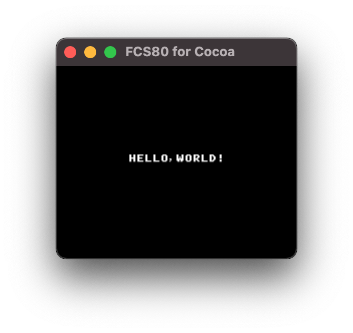

# Hello, World

|        Preview        |
| :-------------------: |
|  |

## How to build

### Pre-request

- GNU make
- clang (for building the depended tools)
- [z88dk](https://z88dk.org/site/)
  - require a `z80asm` command in this example

### Build

```zsh
cd fcs80/example/hello
make
```
