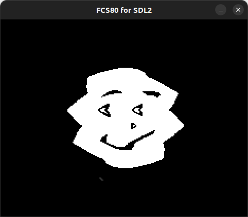

# Raster Scroll

Shake the screen by rewriting the scroll X for each scanline.



## How to build

### Pre-request

- GNU make
- clang (for building the depended tools)
- [z88dk](https://z88dk.org/site/)
  - require `z80asm` command in this example

### Map data

- [mapdata.tmx](mapdata.tmx) & [image.tsx](image.tsx) are data that created with the [Tiled Map Editor](https://www.mapeditor.org).

### Build

```zsh
cd fcs80/example/raster_scroll
make
```
